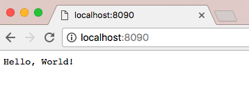
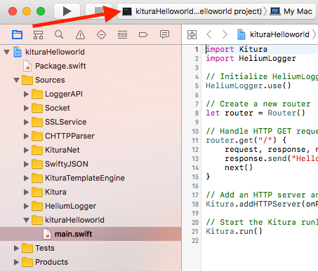
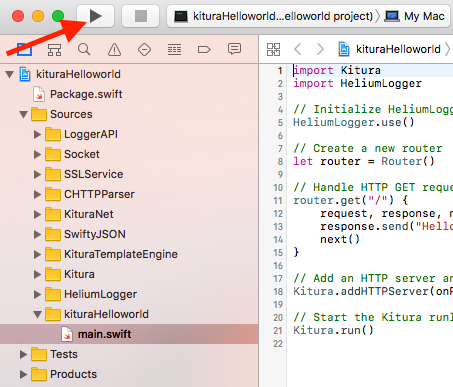

# swift-kitura-helloworld

Learn how to create a simple Kitura web application, add logging, and generate an Xcode project.


A high performance and simple to use web framework for building modern Swift applications.
 * Github: [IBM-Swift/Kitura](https://github.com/IBM-Swift/Kitura)
 * Find this tutorial and more at www.kitura.io!

# Steps

1. [Prerequisites](#1-prerequisites)
2. [Getting Started](#2-getting-started)
3. [Add Logging](#3-add-logging)
4. [Generate Xcode Project](#4-generate-xcode-project)

# 1. Prerequisites

Install swift on your system, see [swift-install](https://github.com/IBM/swift-install).

# 2. Getting Started

Create a new directory for your project:

```
$ mkdir kituraHelloworld
```

Create a swift project using the Swift Package Manger:

```
$ cd kituraHelloworld
$ swift package init --type executable
```

Your **kituraHelloworld** directory should look like this:

```
├── kituraHelloWorld
├── Package.swift
├── Sources
│   └── main.swift
└── Tests
```

In **Package.swift**, add Kitura as a dependency for your project:

```swift
import PackageDescription

let package = Package(
    name: "kituraHelloworld",
    dependencies: [
        .Package(url: "https://github.com/IBM-Swift/Kitura.git", majorVersion: 1, minor: 6)
    ])
```

In **Sources/main.swift**, add the following code:

```swift
import Kitura

// Create a new router
let router = Router()

// Handle HTTP GET requests to /
router.get("/") {
    request, response, next in
    response.send("Hello, World!")
    next()
}

// Add an HTTP server and connect it to the router
Kitura.addHTTPServer(onPort: 8090, with: router)

// Start the Kitura runloop (this call never returns)
Kitura.run()
```

Compile your application:

```
$ swift build
```

Now run your new web application:

```
$ .build/debug/kituraHelloworld
```

If prompted, click Allow:


Open your browser and visit http://localhost:8090.



# 3. Add Logging

Add HeliumLogger as a dependency of your application in **Package.swift**:

```swift
import PackageDescription

let package = Package(
    name: "kituraHelloworld",
    dependencies: [
        .Package(url: "https://github.com/IBM-Swift/Kitura.git", majorVersion: 1, minor: 6),
        .Package(url: "https://github.com/IBM-Swift/HeliumLogger.git", majorVersion: 1, minor: 6)
    ])
```

Enable HeliumLogger in **Sources/main.swift**:

```swift
import Kitura
import HeliumLogger

// Initialize HeliumLogger
HeliumLogger.use()

// Create a new router
let router = Router()

// Handle HTTP GET requests to /
router.get("/") {
    request, response, next in
    response.send("Hello, World!")
    next()
}

// Add an HTTP server and connect it to the router
Kitura.addHTTPServer(onPort: 8090, with: router)

// Start the Kitura runloop (this call never returns)
Kitura.run()
```

Compile your application:

```
$ swift build
```

Now run your new web application:

```
$ .build/debug/kituraHelloworld
```

If prompted, click Allow:


Open your browser and visit http://localhost:8090.

You will see logging output in your console:


# 4. Generate Xcode Project

***Note: MacOS Only***

Navigate to your **kituraHelloworld** directory:

```
$ cd kituraHelloworld
```

Generate the Xcode project:

```
$ swift package generate-xcodeproj
```

Your **kituraHelloworld** directory should look like this:

```
├── kituraHelloWorld
├── Package.swift
├── Packages
├── Sources
│   └── main.swift
├── Tests
└──kituraHelloworld.xcodeproj
```

Open the generated project in Xcode.

Change the build scheme to your executable:



Click Run.



Open your browser and visit http://localhost:8090.

# Troubleshooting

Issues with `swift build`, make sure swift is in your `PATH`:

```
$ export PATH=<path to swift installation>/usr/bin/:$PATH
```

# License
[Apache 2.0](LICENSE)
